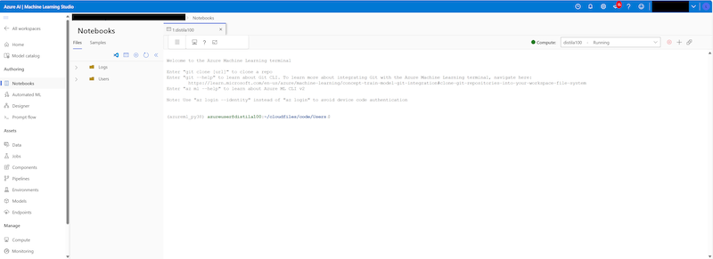
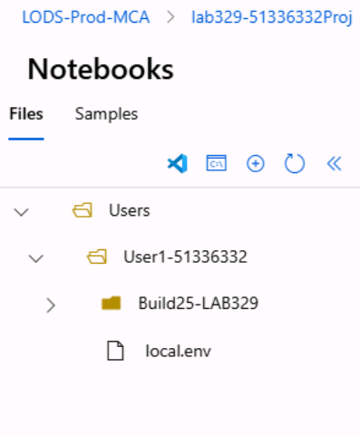

# Model Distillation Lab Manual: Teaching Small Models to Be Smart

## Workshop Duration and Timing
- **Total Workshop Time**: 70 minutes
- **Setup Time**: 5 minutes
- **Hands-On Activities**: 60 minutes
- **Discussion Time**: 5 minutes


## Table of Contents
- Workshop Overview
- Notebook-by-Notebook Guide
  - Step 1: Generate Training Data
  - Step 2: Fine-tune and Optimize
  - Step 3: Test Your ONNX Model
  - Step 4: Register to Azure ML
  - Step 5: Download the Model
  - Step 6: Local Inference
  - Step 7: Local Inference with Foundry Local
- What You've Learned
- Next Steps

## Workshop Overview

Welcome to the Model Distillation Workshop! In this hands-on session, you'll learn how to transform a large language model (DeepSeek-V3) into a smaller, equally capable model (Phi-4-mini) using knowledge distillation.

## Scenario

**Scenario: Edge AI for Education — Efficient Question Answering on Resource-Constrained Devices**

Imagine you are an AI engineer at an EdTech company. Your goal is to deliver an intelligent question-answering assistant that can run on affordable, resource-constrained devices in schools, such as laptops or edge servers, without requiring constant cloud connectivity. However, the best-performing language models are large and expensive to run locally.

In this workshop, you will:
- Use a large, cloud-hosted language model (the "teacher") to generate high-quality answers for a multiple-choice question dataset (CommonsenseQA).
- Distill this knowledge into a much smaller, efficient "student" model (Phi-4-mini) using knowledge distillation and fine-tuning techniques.
- Optimize and quantize the student model (using Microsoft Olive and ONNX) so it can run efficiently on local hardware.
- Register, download, and deploy the optimized model to an edge device using Azure AI Foundry Local.
- Validate that your compact model can answer questions with high accuracy and low latency, even on limited hardware.

This scenario reflects real-world needs for deploying AI in education, healthcare, manufacturing, and other sectors where cost, privacy, and offline capability are critical. By the end of the lab, you will have built an end-to-end workflow for distilling, optimizing, and deploying advanced AI models from the cloud to the edge.

### What You'll Build

By the end of this workshop, you'll create a compact language model that:
- Is **75% smaller** than the original teacher model
- Runs on **standard hardware** without specialized GPUs
- Can be deployed on **edge devices** or embedded systems
- Maintains most of the **capabilities** of the larger model

### Workshop Flow

This is a **practical, code-first workshop**. You'll work through six Jupyter notebooks that guide you step-by-step through:

1. **Data Generation**: Create training examples using a large "teacher" model
2. **Fine-Tuning**: Train a smaller "student" model on this data
3. **Optimization**: Convert and compress the model for efficiency
4. **Testing**: Verify the model works correctly
5. **Registration**: Register your model with Azure ML
6. **Deployment**: Download and run the model locally

Each notebook is designed to be completed in 5-15 minutes, with clear instructions at each step.

## Prerequisites Check

Before you start, ensure you have:

- [x] **Azure ML Studio access** with compute resources allocated
- [x] **Python 3.10+** installed (already in Azure ML Studio)
- [x] **Basic Python knowledge** (understanding of functions, loops, and imports)
- [x] **Terminal/command line familiarity** (basic git commands)
- [x] **Internet connectivity** (to access datasets and models)

> **Important:** This workshop uses Azure ML Studio and requires access to a deployed Azure AI model endpoint. You should have already been provided with the necessary credentials.

## Environment Setup

Let's start by setting up your environment and cloning the code repository to your Azure Machine Learning Workspace.

### 1. Access Azure ML Studio

Open Azure ML Studio by:
1. Go to Azure ML Studio +++https://ml.azure.com+++
2. Sign in with your Azure credentials
3. Select your workspace (provided by your instructor)
4. Navigate to the "Notebooks" section

Let's start with the first notebook!

## Clone the GitHub Repo and resources to your Azure ML Studio 

Open your Azure ML Studio +++https://ml.azure.com+++


Select Notebooks


Select Terminal



2. To clone the repository and set up your environment for the lab, follow these steps in the terminal:

```
cd Users &&
      cd User1-* &&
      git clone https://github.com/microsoft/Build25-LAB329 &&
      cd Build25-LAB329
```


3. Create Your Environment File: Copy the `sample.env` in the `notebooks` environment file and rename it to local.env in the root of your solution in the users folder. The local environment file is used to store your Azure credentials:

We provide a `sample.env` file in the `notebooks` folder you will need to create a `local.env` file and save this to your user folder 



Add your credentials to the file these are provided in the resouce tab:

```
TEACHER_MODEL_NAME=DeepSeek-V3
TEACHER_MODEL_ENDPOINT=https://your-endpoint.services.ai.azure.com/models
TEACHER_MODEL_KEY=your-api-key-here
AZUREML_SUBSCRIPTION_ID=your-subscription-id
AZUREML_RESOURCE_GROUP=your-resource-group
AZUREML_WS_NAME=your-workspace-name
```

Save the file in root of your your user folder as in the image above save and close the `local.env`.


4. **Navigate to the Lab Directory**: Go to the Lab329 folder containing the notebooks:

```bash
cd Build-Lab329/Lab329/Notebook
```

## Notebook-by-Notebook Guide

This workshop uses 7 Jupyter notebooks that you'll run in sequence. Each notebook builds on the previous one, so it's important to complete them in order. We will be your Azure ML workspace Notebook environment for notebooks 1 - 4 you will then be using the Skillable VM for notebooks 5 - 7.

Let's look at each notebook and what you'll do:

| Notebook | Purpose | Duration |
|----------|---------|----------|
| 01_AzureML_Distillation | Generate training data using DeepSeek-V3 | 15 min |
| 02_AzureML_FineTuningAndConvertByMSOlive | Fine-tune Phi-4-mini with LoRA and optimize | 15 min |
| 03_AzureML_RuningByORTGenAI | Test model inference with ONNX Runtime | 10 min |
| 04_AzureML_RegisterToAzureML | Register model to Azure ML | 5 min |
| 05_Local_Download | Download model for local deployment | 5 min |
| 06_Local_Inference | Run inference locally | 10 min |
| 07_Local_Inference | Run inference locally with Foundry Local | 10 min |

Now you’re ready to work with the repository on your Azure ML Studio +++https://ml.azure.com+++
